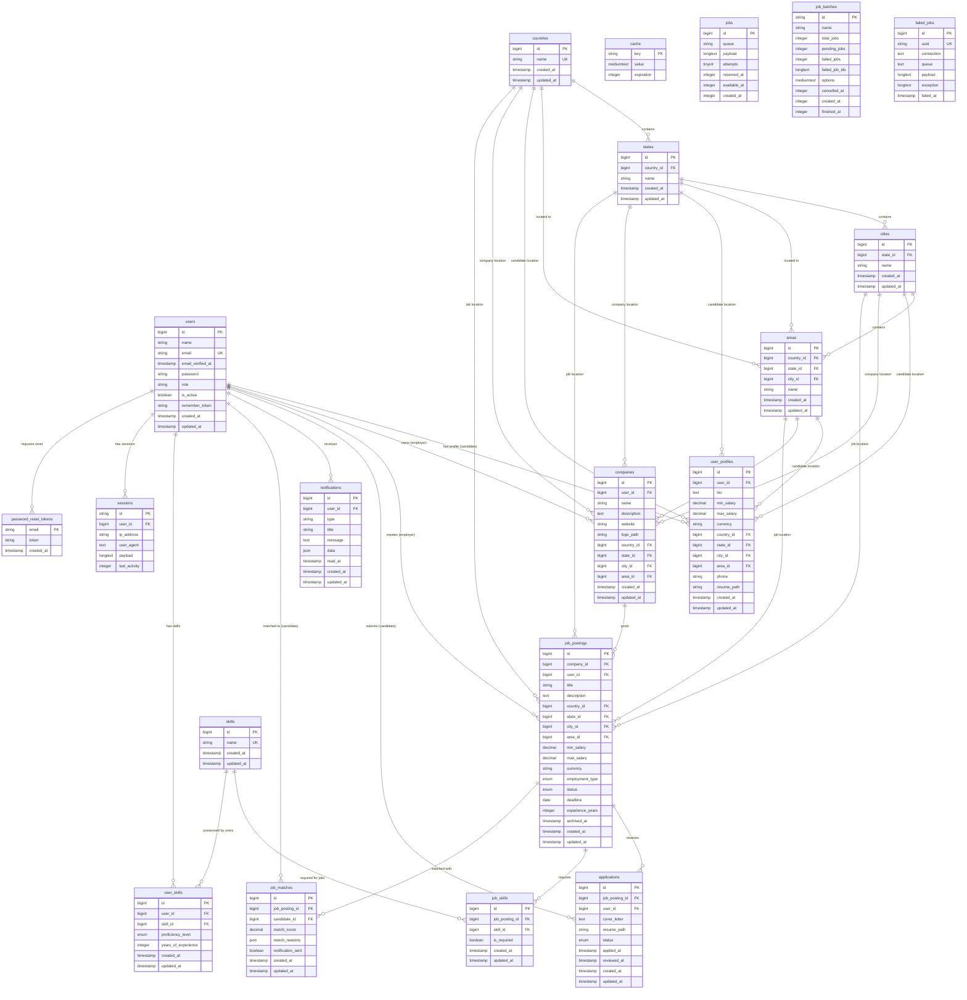

# HireSmart Backend - Entity Relationship Diagram (ERD)

This document provides a comprehensive view of the HireSmart backend database structure, including all tables, relationships, and constraints.

## Database Overview

The HireSmart system uses **PostgreSQL** as its primary database with a well-structured relational design supporting:

- **Multi-role User System** (Admin, Employer, Candidate)
- **Hierarchical Location System** (Country → State → City → Area)
- **Job Management System** with skill matching
- **Application Management System** with status tracking
- **Background Job Matching System**
- **Notification System**

---

## Entity Relationship Diagram

---

## Table Descriptions

### **Core User Tables**

| Table | Purpose | Key Features |
|-------|---------|--------------|
| `users` | Main user authentication and basic info | Role-based (admin/employer/candidate), email verification, active status |
| `user_profiles` | Extended candidate profiles | Salary expectations, location preferences, resume storage |
| `companies` | Employer company information | Company details, location, branding |

### **Location Hierarchy Tables**

| Table | Purpose | Relationship |
|-------|---------|--------------|
| `countries` | Country master data | Root level |
| `states` | State/Province data | Belongs to country |
| `cities` | City data | Belongs to state |
| `areas` | District/Area data | Belongs to city, state, country |

### **Job Management Tables**

| Table | Purpose | Key Features |
|-------|---------|--------------|
| `job_postings` | Job listings | Status management, salary range, location, deadlines |
| `applications` | Job applications | Status tracking, document storage, timestamps |
| `skills` | Master skills database | Unique skill names |
| `job_skills` | Job skill requirements | Required vs optional skills |
| `user_skills` | User skill profiles | Proficiency levels, experience years |

### **Matching & Communication Tables**

| Table | Purpose | Key Features |
|-------|---------|--------------|
| `job_matches` | AI job matching results | Match scores, reasoning, notification tracking |
| `notifications` | System notifications | User alerts, read status, metadata |

### **System Tables**

| Table | Purpose | Usage |
|-------|---------|-------|
| `password_reset_tokens` | Password reset flow | Temporary token storage |
| `sessions` | User sessions | Web session storage (backup) |
| `cache` | Application cache | Redis alternative/fallback |
| `jobs` | Background job queue | Async task processing |
| `job_batches` | Batch job management | Bulk operation tracking |
| `failed_jobs` | Failed job logging | Error tracking and retry |

---

## Key Constraints and Indexes

### **Unique Constraints**
- `users.email` - Prevent duplicate user accounts
- `skills.name` - Prevent duplicate skills
- `countries.name` - Prevent duplicate countries
- `applications(job_posting_id, user_id)` - Prevent duplicate applications
- `failed_jobs.uuid` - Unique failure tracking

### **Foreign Key Constraints**
- **Cascade Deletes**: User deletion cascades to profiles, companies, jobs, applications
- **Set Null**: Location deletion sets related fields to null (data preservation)
- **Restrict**: Prevent deletion of referenced skills or system data

### **Performance Indexes**
- **Job Search**: `job_postings(status, country_id, state_id, city_id, area_id)`
- **Application Status**: `applications(status, applied_at)`
- **Employment Type**: `job_postings(employment_type, status)`
- **Location Hierarchy**: Multi-column indexes on location foreign keys
- **Salary Range**: `user_profiles(min_salary, max_salary)`

---

## Business Rules

### **User Roles**
- **Admin**: Full system access, user management, analytics
- **Employer**: Job posting, application management, candidate search
- **Candidate**: Job search, application submission, profile management

### **Application Flow**
1. Candidate applies to job posting
2. Status: `pending` → `reviewed` → `shortlisted`/`rejected` → `hired`
3. Each status change creates notification
4. Background matching suggests relevant candidates

### **Location Hierarchy**
- **Required**: Country → State → City → Area
- **Flexible**: Allows partial location specification
- **Consistent**: Same hierarchy used for users, companies, and jobs

### **Skill Matching**
- **Job Skills**: Required vs Optional skill designation
- **User Skills**: Proficiency levels and experience years
- **Matching Algorithm**: Weighted scoring based on skill overlap

---

## Data Integrity Features

- **Referential Integrity**: Foreign key constraints ensure data consistency
- **Unique Constraints**: Prevent data duplication at database level
- **Enum Validation**: Controlled vocabulary for status fields
- **Timestamp Tracking**: Complete audit trail with created/updated timestamps
- **Soft Deletes**: Available through Laravel (archived_at fields)
- **Index Optimization**: Query performance optimization for common access patterns

---

This ERD represents a production-ready database design that supports scalable job matching, user management, and business analytics for the HireSmart platform. 